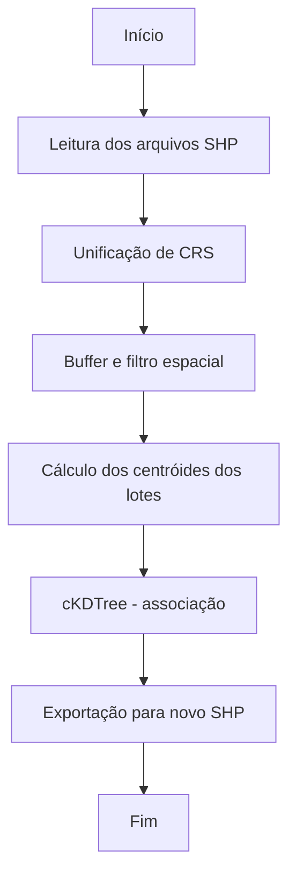

# Fluxo de Trabalho

```mermaid
flowchart TD
    A[Início] --> B[Leitura dos arquivos SHP]
    B --> C[Unificação de CRS]
    C --> D[Buffer e filtro espacial]
    D --> E[Cálculo dos centróides dos lotes]
    E --> F[cKDTree - associação]
    F --> G[Exportação para novo SHP]
    G --> H[Fim]
```
